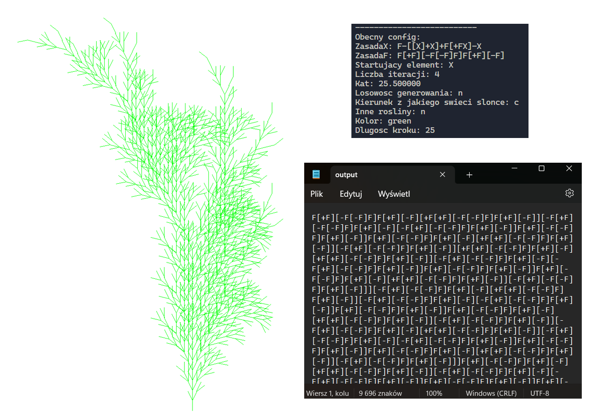
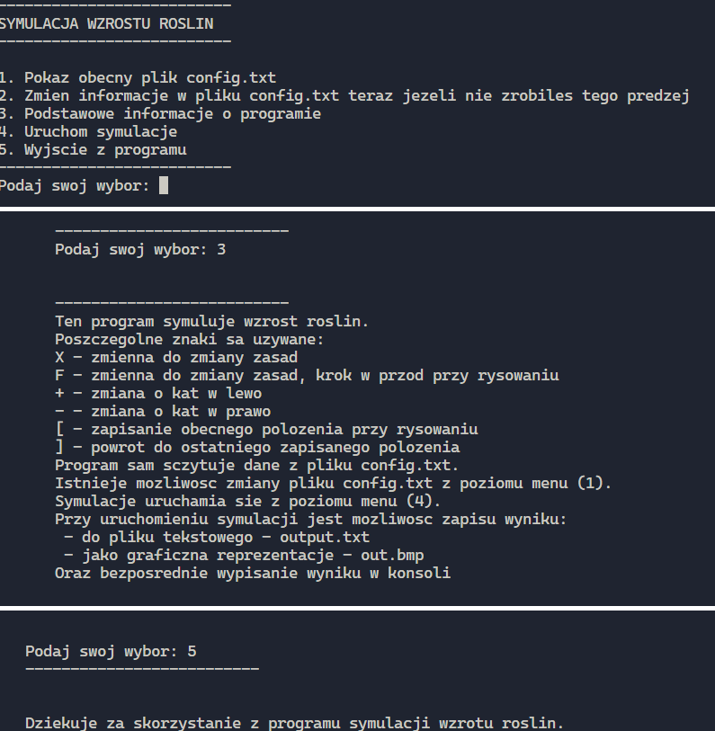
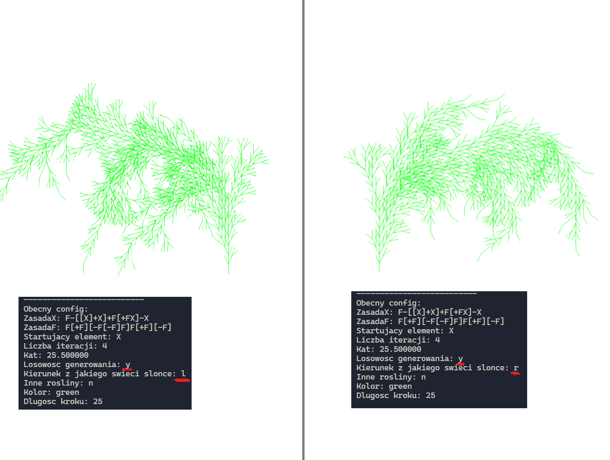
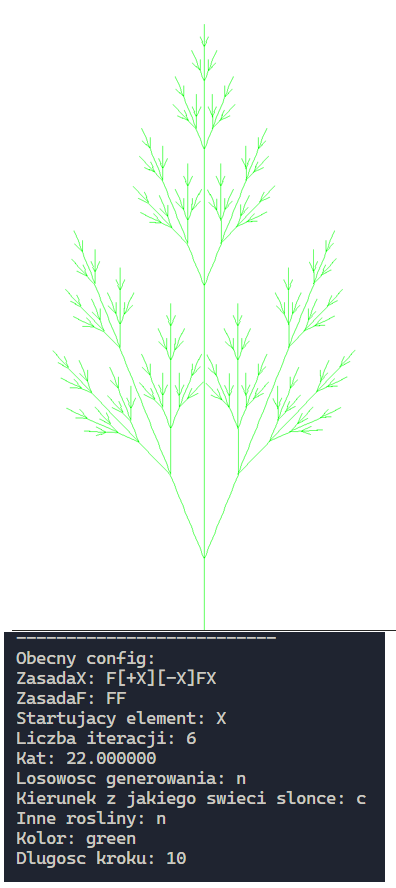
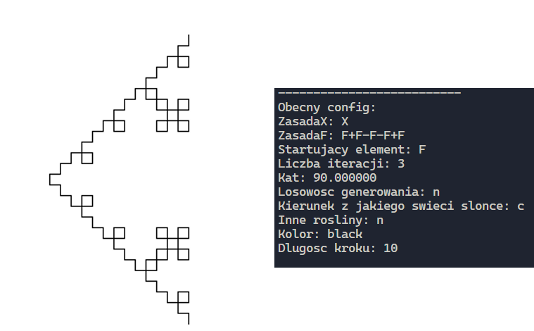

# Dokumentacja programu wzorowanego na L-systemach

## Definicja problemu badawczego
Głównym celem programu jest symulacja wzrostu roślin przy użyciu L-systemów (systemów Lindenmayera). L-systemy to zestawy reguł produkcji gramatyki formalnej służące do tworzenia graficznych tworów o fraktalnej budowie. Reguły użyte w moim programie wzorowane są na gotowych algorytmach powstawania roślin [(wiecej na stronie - wikipedia)](https://en.wikipedia.org/wiki/L-system#Example_7:_fractal_plant), ktore zostały odrobine zmodyfikowane (wiecej przy opisie pliku config). Symulacje przeprowadzone w programie wraz z ich graficznymi reprezentacjami tworzą dobry obraz tego, jak poglądowo mogą wyglądać rośliny ze względu na zmiany różnych czynników otoczenia bądź ich własnych parametrów.

## Wpływ różnych czynników na końcowy wygląd rośliny - główny problem badawczy  

## Czego chcielibyśmy się dowiedzieć?
Program w głownej mierze umożliwia nam zilustrowanie tego jak może wyglądać roślina poddana różnym czynnikom.
W programie dostępne są między innymi symulacje, z których dowiedzieć się możemy, jak może wyglądać roślina: 
- przy istniejących już lub dodanych/wymyślonych przez użytkownika zasadach symulacji
- w różnym momencie rozwoju - ilosc iteracji
- w zależności od tego czy ma być bardziej wąska czy szeroka
- w zależności od tego z której strony świeci słońce
- jeśli występują inne rośliny w jej pobliżu
- w zależności od jej dlugości
Istnieje więcej sekwencji - możemy dowolnie mieszać zmienne np. inne rośliny ze słońcem na lewo

## Rozwiązania różnych problemów
Program został zaprojektowany do symulacji wzrostu roślin na podstawie zewnętrznego pliku konfiguracyjnego, który zawiera parametry takie jak:
- Reguły produkcji (ruleX, ruleF) - podanie zasad
- Element początkowy (start) - podanie elementu od jakiego zaczynamy
- Liczba iteracji (iterations) - ilosc iteracji
- Kąt obrotu (angle) - kąt w stopniach
- Możliwość generowania za każdym razem inengo podobnego fraktala (random_generate) - y-tak, n-nie
- Kierunek światła słonecznego (sunlight_direction) - l-lewo, r-prawo, c- srodek
- Obecność innych roślin (other_plants) - y-tak, n-nie
- Kolor rysunku (color) - kolor rysowania:red-czerwony, green-zielony, blue-niebieski, black-czarny-domyslny
- Długość kroku (step) - jak dluga kreska ma zostac narysowana

Program jest bardzo intuicyjny, umożliwia zmianę konfiguracji za pomocą zewnętrznego pliku, a także z poziomu menu oraz wyświetla wyniki w terminalu i zapisuje je w plikach tekstowych i graficznych na życzenie użytkownika.

### Przykładowa zawartość pliku konfiguracyjnego

```
ruleX=F-[[X]+X]+F[+FX]-X
ruleF=F[+F][-F[-F]F]F[+F][-F]
start=X
iterations=4
angle(deg)=25.5
random_generate(y/n)=n
sunlight_direction(l/r/c)=c
other_plants(y/n)=n
color(red/green/blue/black)=green
step=25
```



## Przykład użycia

### Wszystkie przykłady z rozwiązaniem tego czego chcielbysmy sie dowiedziec znajduja sie w [folderze slajdy](./prezentacja_slajdy/) oraz w [pliku prezentacja](./Prezentacja.pdf)

- Menu programu


- Porównanie słońca z lewej i z prawej strony


- Inne zasady




## Dodatkowe biblioteki
- "turtle.h" oraz plik do niej "turtle.c" - Jedyna dodatkowa biblioteka dołączona do tego programu Odpowiedzialna jest za reprezentację graficzną [Turtle C library](https://w3.cs.jmu.edu/lam2mo/cs240_2015_08/turtle.html)


## Poprawne skompilowanie programu
1. Pobrać wszystkie pliki z repozytorium i umieścic je w jednym folderze.

2. Użyć w konsoli komendy (będąc w folderze, gdzie znajdują się nasze pliki): `gcc -Wall -Wextra .\main.c .\turtle.c` służy ona do sprawdzenia, czy program kompiluje prawidłowo - bez błędów.

> w moim przypadku pojawia się ostrzeżenie związane z biblioteką turtle.h

> zamiast `strncpy(bmph.bfType, "BM", 2);` w pliku turtle.c:714 powinno się użyć `memcpy(bmph.bfType, "BM", 2);`, jednak nie jest to moja biblioteka, podaje tylko przykładowe rozwiązanie ostrzeżenia

3. Po użyciu komendy z punktu 2 powinien stworzyć nam się program wykonywalny o nazwie a.exe.

4. Dalej w konsoli (oraz dalej przy tej samej lokalizjaci plików) użyć komendy: `.\a.exe` (albo, jeżeli użyliśmy opcji -o `.\użyta_nazwa.exe`).

5. Program powinien się uruchomić. Można zaczynać symulacje.


### Dodatkowe informacje

> istnieją też możliwości użycia tego programu (nawet z takimi samymi zasadami) do czegoś zupelnie innego 

>Program jest napisany w taki sposób, że uda mu sie obsłużyć również inne zasady - nie dotyczące roślin w ktorych występuje krok, kąt np. krzywa Kocha 